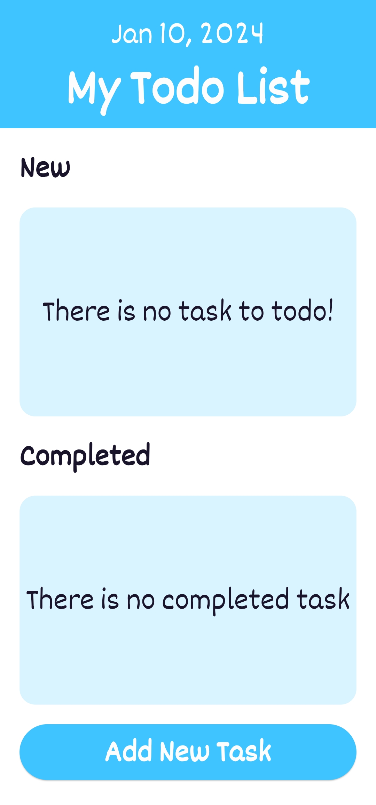
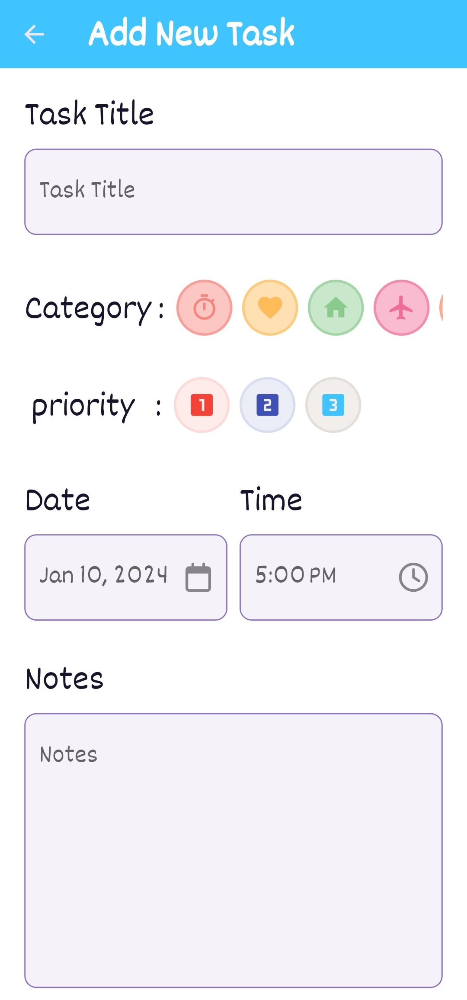
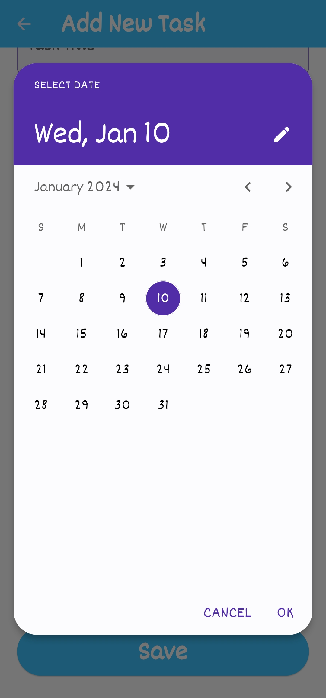
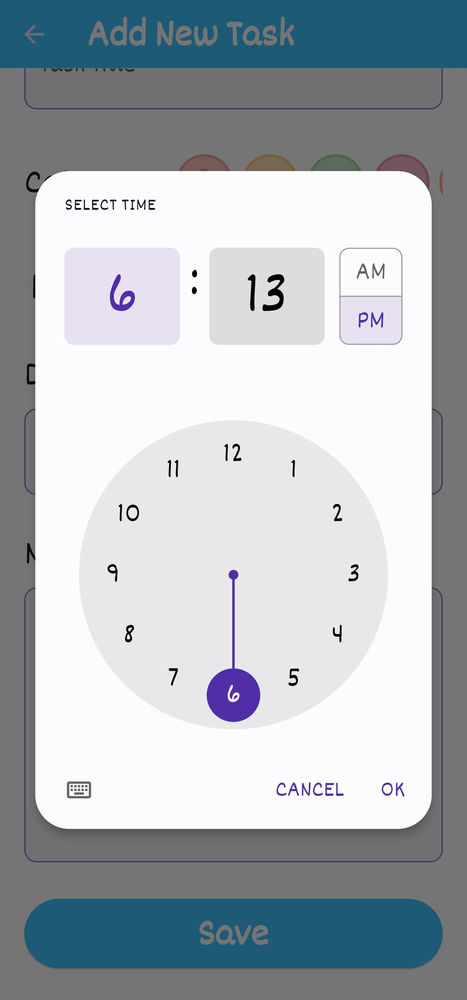
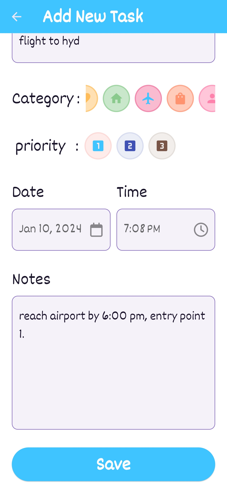
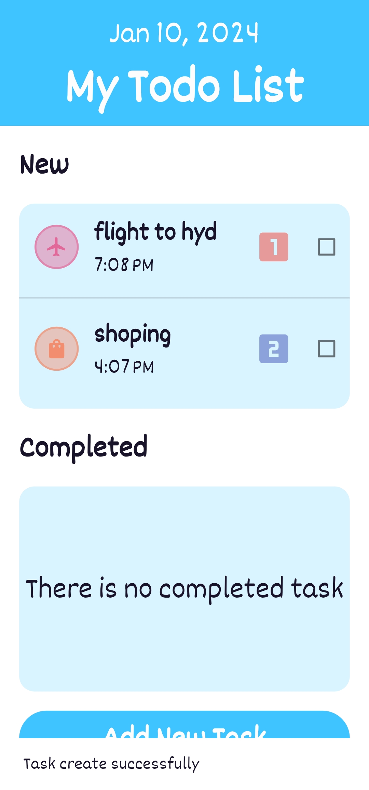
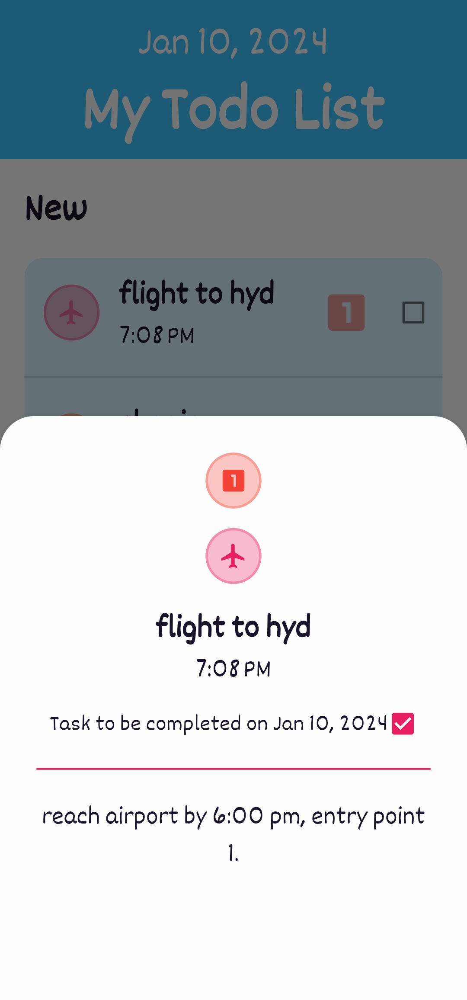
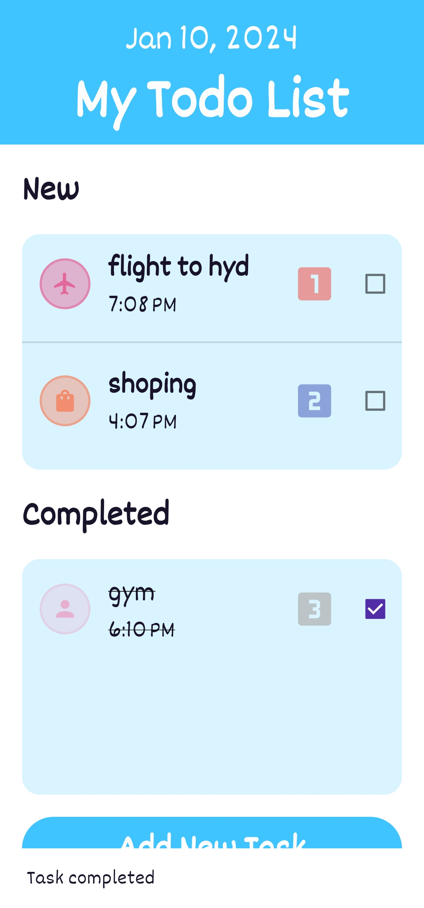
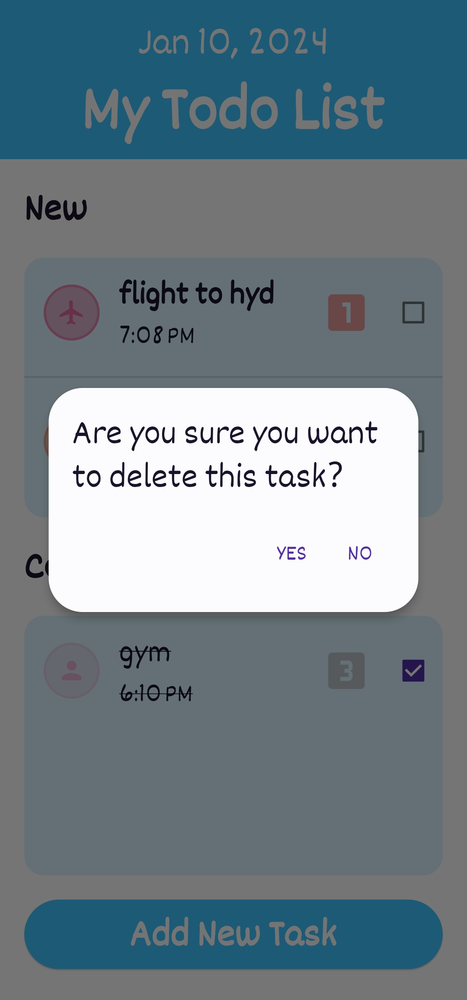

My Todo List App

https://github.com/G-Sai-Charan/keka_todo_list_app/assets/102489136/17f385cb-2598-4835-9570-aac6c8537a1a
  
Brief Description:

This Todo app is a Flutter-based application built with Riverpod, focusing on 
providing a clean and efficient way to manage tasks through CRUD operations 
(Create, Read, Update, Delete). The state management is handled using Riverpod, 
promoting a declarative and maintainable approach to handle the application state. 
The app also utilizes SQLite (sqflite) for local storage to persist tasks.

Key Features and Requirements:

- Due Date: Each task is associated with a due date.
- Priority Levels: Tasks can be assigned priority levels - Low, Medium, or High.
- Category: Tasks can be categorized to help organize and filter them.
- Task Status: Tasks can be marked as New, In Progress, or Completed.
- Title and Description: Each task has a title and a detailed description.
- The app uses local storage to save tasks, ensuring data persistence.

Technical Specifications:

Platform -Android / iOS
Language -Dart
Local Storage -SQLite (sqflite)
User Interface -The UI is designed to be clean and responsive by suing flutter.

 Getting Started:

1. Clone this repository to your local machine. git clone   
     https://github.com/your/repo.git
2. Ensure you have Flutter and Dart installed on your development environment.
     Flutter version: '>=3.2.3 <4.0.0'
     Dart version: '>=2.15.0 <3.0.0'
4. Open the project folder in Android Studio/vscode.
5. Run `flutter pub get` to fetch and install the required dependencies.
6. Launch the app on an emulator or physical device using `flutter run`.

How to Use the App:

1. Click on the "Add New Task" button to create a new task.
2. Enter the task title, description, category, priority, due date, and time.
3. Click on the "Save" button to create the task.
4. The task will be displayed in the list of tasks.
5. You can click on a task to view its detailed information.
6. You can click on the checkbox next to a task to mark it as completed.
7. You can long-press on a task to delete it.

Screenshots:

                   
                   
                
                
     

